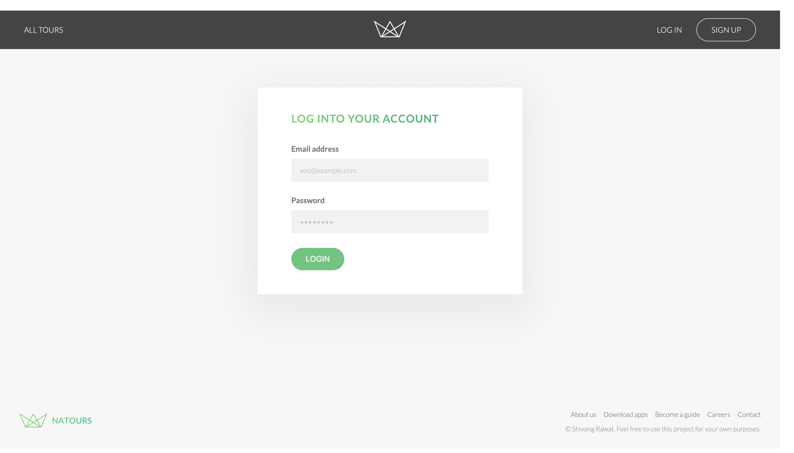

# Natours

Natours is a tour booking website that allows users to discover and book exciting tours around the world. The application is built using Express.js, Node.js, MongoDB, Mongoose, and Pug templates.

## Features

- User authentication and authorization with JWT (JSON Web Tokens)
- Secure user signup and login functionality
- User profile management with the ability to change password and personal details
- Tour browsing and booking functionality
- Payment integration for credit card transactions
- Interactive map showcasing tour locations
- Email notifications for booking confirmation and updates

## Technologies Used

- Express.js: Fast and flexible web application framework
- Node.js: JavaScript runtime environment
- MongoDB: Document-oriented NoSQL database
- Mongoose: Elegant MongoDB object modeling for Node.js
- Pug: Template engine for rendering dynamic views
- JWT: JSON Web Tokens for user authentication
- Mapbox: Map integration for displaying tour locations
- Stripe: Payment processing integration for credit card payments
- Nodemailer: Email delivery module for sending booking notifications
